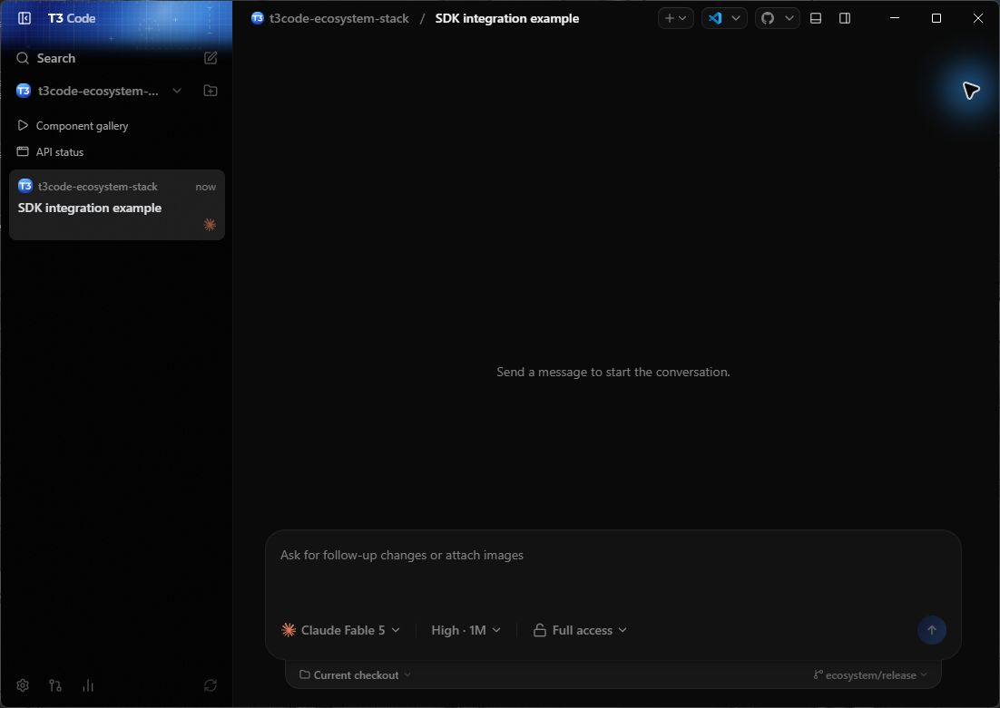
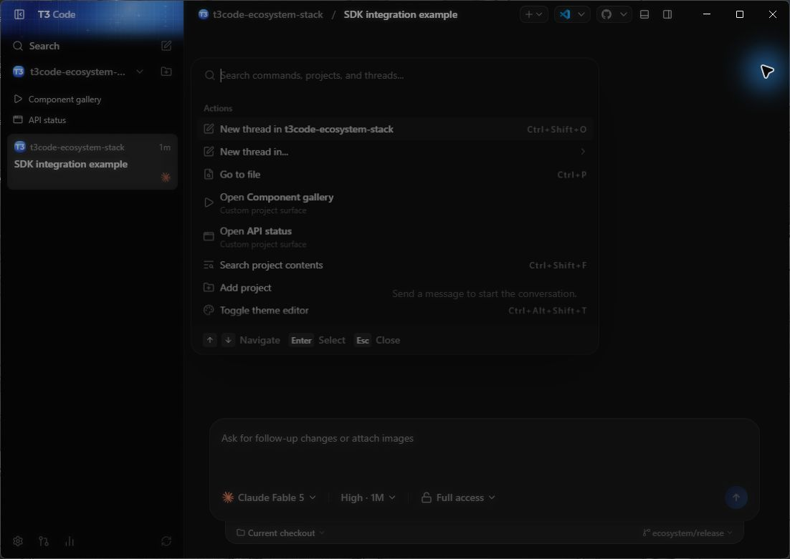

# T3 integrations

A T3 integration runs as a separate program and connects to one T3 server over HTTP and
WebSocket. T3 Code does not load integration code into its server or clients.

## Install the packages

Use the SDK for a Promise client:

```sh
pnpm add @t3tools/sdk effect
```

`@t3tools/sdk/effect` exports the Effect client. Raw commands and RPC helpers live under
`@t3tools/sdk/unstable` and can change between releases.

The SDK installs `@t3tools/contracts` for its wire types. Install the contracts package directly
only when your app imports `@t3tools/contracts/integration`.

```sh
pnpm add @t3tools/contracts effect
```

Use the same version for every `@t3tools` package and the T3 server. See the
[SDK guide](../../packages/sdk/README.md) for client examples and token storage.

The UI kit uses React 19 and Tailwind CSS 4:

```sh
pnpm add @t3tools/ui @base-ui/react react@19 react-dom@19 tailwindcss@4
```

Import its theme and each component by name:

```css
@import "tailwindcss";
@import "@t3tools/ui/theme.css";
@source "../node_modules/@t3tools/ui/dist";
```

```tsx
import { Button } from "@t3tools/ui/button";
```

The package has no root component export. The [UI kit guide](../../packages/ui/README.md) lists
the available paths and theme variables.

## Connect an app

The SDK needs the HTTP origin of one environment. It does not scan the network.

Issue a short-lived bearer token on the machine that owns the environment:

```sh
npx t3 auth session issue --ttl 1h --label my-app --token-only
```

This command grants administrative access. Store the token as a secret and keep its lifetime
short. Pass `--base-dir` when the server uses a non-default T3 home.

```ts
import { createT3Client } from "@t3tools/sdk";

const client = createT3Client({
  baseUrl: process.env.T3_URL ?? "http://127.0.0.1:3773",
  auth: { type: "bearer", token: process.env.T3_TOKEN! },
});

try {
  const environment = await client.descriptor();
  console.log(environment.environmentId);
} finally {
  await client.close();
}
```

For standard client permissions, create a one-time pairing credential:

```sh
npx t3 auth pairing create --ttl 10m --label my-app --json
```

Pass the returned `credential` as `auth: { type: "pairing", credential }`. Save the token passed
to `onToken`. On the next start, use that value as `auth: { type: "token", token }`. A pairing
credential can be exchanged once.

## Revoke access

List and revoke pairing credentials:

```sh
npx t3 auth pairing list
npx t3 auth pairing revoke <id>
```

List and revoke sessions:

```sh
npx t3 auth session list
npx t3 auth session revoke <session-id>
```

Revoking a pairing credential does not revoke a session already created from it. Revoke that
session too. Session revocation blocks new HTTP requests and WebSocket connections. An open
WebSocket stays connected until the integration closes it or the connection drops.

## Add a project surface

A project can declare web pages in `t3.json`. T3 Code opens them in the desktop preview and fills
in project, thread, environment, and server placeholders.

```json
{
  "$schema": "https://t3.codes/schema/t3.json",
  "surfaces": [
    {
      "name": "Task board",
      "icon": "configure",
      "url": "http://localhost:4310/projects/{projectId}",
      "threadUrl": "http://localhost:4310/projects/{projectId}/threads/{threadId}"
    }
  ]
}
```

Project surfaces require an existing thread and a URL the desktop machine can reach. Browser and
mobile clients do not open them. T3 Code does not inject an API into the page. See
[Custom project surfaces](./project-surfaces.md) for placeholders, launchers, and error cases.

Filter the desktop sidebar to the project to show its entries above the thread list:



The same entries appear in the command palette for the active project:



## Remote connections

An integration can use a direct server URL over a LAN, Tailscale, or an HTTPS tunnel. Use HTTPS
outside a private network. The SDK does not perform the managed T3 Connect relay sign-in or DPoP
exchange. A T3 Connect pairing credential cannot replace a direct server URL and a server-issued
session.

A tunnel to the T3 server does not proxy a project surface page. The desktop client must be able
to reach that page itself. [Remote access](./remote-access.md) covers server addresses and pairing.

## Limits

- Integrations run in separate processes. There is no executable plugin runtime, installer, or
  marketplace.
- Project surfaces work in the desktop app and need an existing thread.
- Imports under `@t3tools/sdk/unstable` have no compatibility guarantee.
- Optional SDK behavior must be checked through the environment descriptor.
